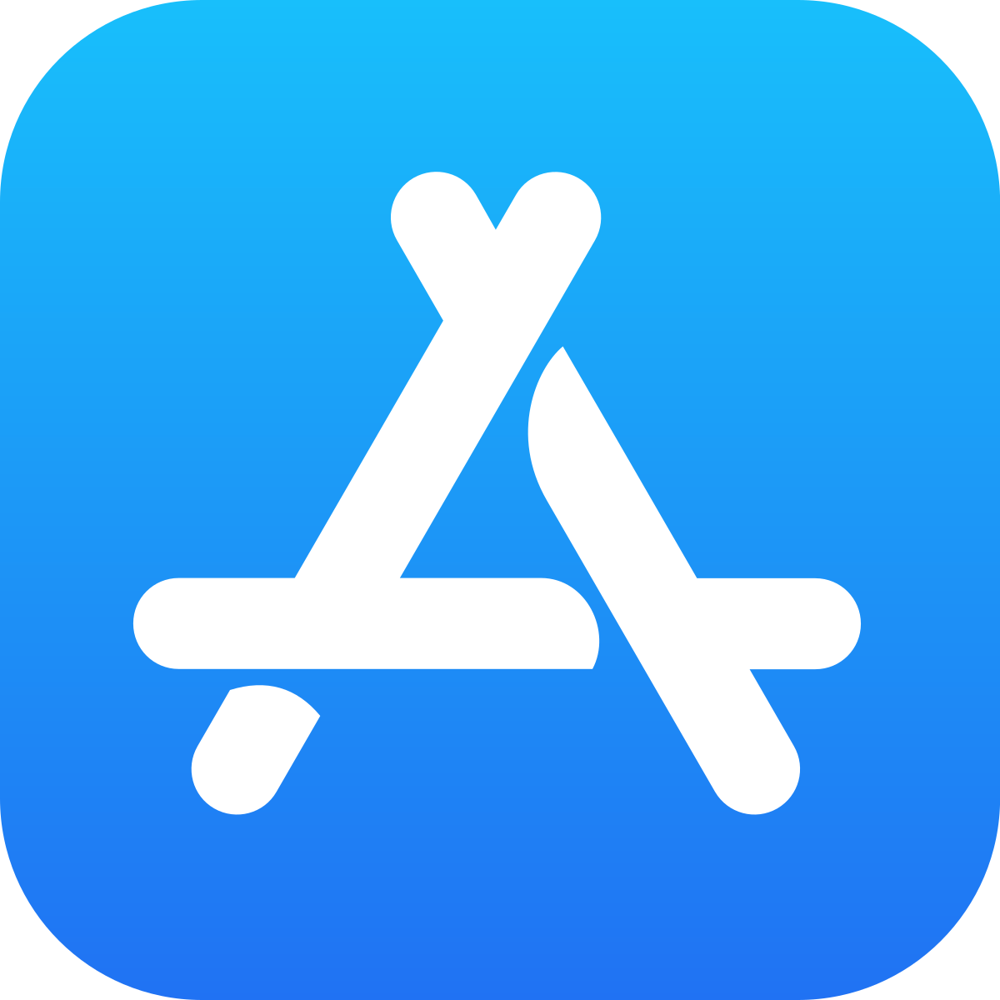
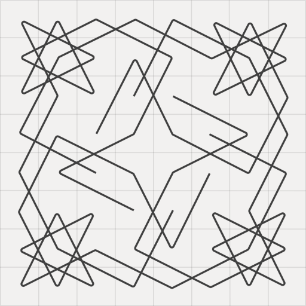
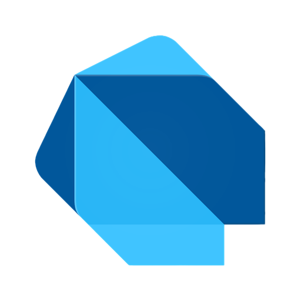

<pre>
+----------------------------+
|      <a href="https://khlebobul.github.io">personal website</a>      |
+----------------------------+
        \   ^__^
         \  (oo)\_______
            (__)\       )\/\
                ||----w |
                ||     ||
</pre>

#### Side projects
<table>
  <thead>
    <tr>
      <th width="60"></th>
      <th>Description</th>
      <th width="90"></th>
    </tr>
  </thead>
  <tbody>
    <tr>
      <td width="60" align="center">
        
      </td>
      <td>
        <a href="https://pegma.vercel.app">Pegma</a> — Discover the pure challenge of the classic Peg Solitaire — free, open source, and fun to master!
      </td>
      <td width="90" align="center">
        

 

 

 

      </td>
    </tr>
    <tr>
      <td width="60" align="center">
        
      </td>
      <td>
        <a href="https://boardbuddyapp.vercel.app">Board Buddy</a> — Your ultimate board game companion
      </td>
      <td width="90" align="center">
        

 

 

 

      </td>
    </tr>
    <tr>
      <td width="60" align="center">
        
      </td>
      <td>
        <a href="https://knightsgraph.vercel.app">Knight's Graph</a> — Fascinating puzzle game based on the ancient Knight's Tour problem
      </td>
      <td width="90" align="center">
        

 

 

      </td>
    </tr>
  </tbody>
</table>

  
<strong>Flutter packages</strong>

  <table>
    <thead>
      <tr>
        <th width="60"></th>
        <th>Description</th>
        <th width="90"></th>
      </tr>
    </thead>
    <tbody>
      <tr>
        <td width="60" align="center">
          
        </td>
        <td>
          <a href="https://pub.dev/packages/not_static_icons">not_static_icons</a> — Beautifully crafted animated icons for flutter made with lucide icons
        </td>
        <td width="90" align="center">
          

 

        </td>
      </tr>
      <tr>
        <td width="60" align="center">
          
        </td>
        <td>
          <a href="https://pub.dev/packages/use_scramble">use_scramble</a> — Lightweight package for random text animations
        </td>
        <td width="90" align="center">
          

        </td>
      </tr>
      <tr>
        <td width="60" align="center">
          
        </td>
        <td>
          <a href="https://pub.dev/packages/gen_art_bg">gen_art_bg</a> — Animated generative art backgrounds collection flutter
        </td>
        <td width="90" align="center">
          

        </td>
      </tr>
    </tbody>
  </table>

  
<strong>Others</strong>

  <table>
    <thead>
      <tr>
        <th>Name</th>
        <th>Description</th>
      </tr>
    </thead>
    <tbody>
      <tr>
        <td><a href="https://www.raycast.com/khlebobul">Raycast extensions</a></td>
        <td>Helpful raycast extensions for developers</td>
      </tr>
      <tr>
        <td><a href="https://lego-processor.vercel.app">Lego block image processor</a></td>
        <td>Images ➭ Lego blocks instruction</td>
      </tr>
      <tr>
        <td><a href="https://khlebobul26.gumroad.com/l/figure8">Figure 8</a></td>
        <td>Companion for maintaining eye health</td>
      </tr>
      <tr>
        <td><a href="https://www.figma.com/community/plugin/1441862652881971511/square-ribbon">Square ribbon</a></td>
        <td>Figma plugin</td>
      </tr>
      <tr>
        <td><a href="https://wave-logo.vercel.app/">Wave logo generator</a></td>
        <td>Logo buddy</td>
      </tr>
    </tbody>
  </table>

  
<strong>Experiments</strong>

  <table>
    <thead>
      <tr>
        <th>Description</th>
        <th width="90" align="center"></th>
      </tr>
    </thead>
    <tbody>
      <tr>
        <td>
          <a href="https://github.com/khlebobul/flutter_voice_control_example_app">Flutter voice control example app</a> — Flutter app example with local speech recognition and voice command control using sherpa-onnx
        </td>
        <td width="90" align="center">
          

 

        </td>
      </tr>
      <tr>
        <td>
          <a href="https://github.com/khlebobul/ascii_blur">ASCII blur</a> — Images ➭ an artistic blend of blur and ASCII art with flutter
        </td>
        <td width="90" align="center">
          

        </td>
      </tr>
      <tr>
        <td>
          <a href="https://github.com/khlebobul/ascii_cat">ASCII cat</a> — Cute ASCII cat app 🐈‍⬛
        </td>
        <td width="90" align="center">
          

        </td>
      </tr>
      <tr>
        <td>
          <a href="https://github.com/khlebobul/ascii_camera">ASCII camera</a> — ASCII camera effect with flutter
        </td>
        <td width="90" align="center">
          

 

        </td>
      </tr>
      <tr>
        <td>
          <a href="https://github.com/khlebobul/dynamic_island_pet">Dynamic Island pet</a> — Dynamic Island pet companion
        </td>
        <td width="90" align="center">
          

 

        </td>
      </tr>
    </tbody>
  </table>

